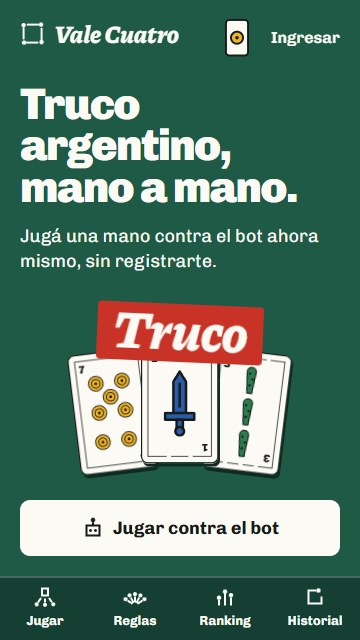
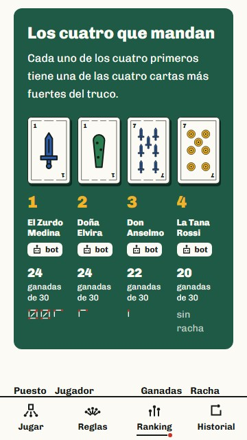

# Vale Cuatro

Truco argentino online, mano a mano: contra un bot o contra otra persona por un link de invitación.
La idea es que cualquiera que entre pueda jugar una mano contra el bot en menos de 30 segundos, sin registrarse.

**Se puede jugar en [vale-cuatro.onrender.com](https://vale-cuatro.onrender.com).** Está en un plan gratuito que se duerme cuando pasa un rato sin visitas: si la primera carga tarda cerca de un minuto, es que se está despertando.

Proyecto de portfolio de Román Gonzalez.


| Portada | Mazo propio |
|---|---|
|  |  |

| Ranking | Repetición de una partida |
|---|---|
|  |  |

| El envido se canta | Cierre de la mano |
|---|---|
|  |  |

| Ingreso | Registro |
|---|---|
|  |  |

| Modos de juego | En el celular |
|---|---|
|  |  |

| Portada en el celular | Ranking en el celular |
|---|---|
|  |  |

## Qué es real y qué es simulado

- **Simulado, y dicho abiertamente en el sitio:** los rivales bot y los jugadores de ejemplo del ranking, que aparecen marcados como bots.
- **Real:** el motor de reglas, el tiempo real por WebSockets, las colas, el historial de partidas, el ranking y los tests.

## Estado

El proyecto se construye por módulos. Hoy están terminados los nueve primeros, de M0 a M8, y el sitio está publicado.

**El juego mano a mano**

| Módulo | Qué es | Estado |
|---|---|---|
| M0 | Identidad visual y maqueta de las pantallas | Listo |
| M1 | Cuentas y modo invitado | Listo |
| M2 | Motor de reglas en PHP puro, pensado por asientos y equipos | Listo |
| M3 | Mesa contra el bot, con la partida guardada como eventos | Listo |
| M4 | Bot con cuatro niveles, del Fácil al Ultra difícil, que juega desde una cola | Listo |
| M5 | Dos personas en tiempo real, por un link de invitación | Listo |
| M6 | Tanteador, cantos y movimiento | Listo |
| M7 | Historial y repetición jugada por jugada | Listo |
| M8 | Ranking y estadísticas, calculadas desde los eventos de cada partida | Listo |

**Lo que sigue**

| Módulo | Qué es | Estado |
|---|---|---|
| M11a | Publicación del sitio y pruebas automáticas en un navegador real | Listo |
| M12 | Revancha y series al mejor de tres, contra el bot y entre dos personas | Listo |
| M13 | Torneo relámpago de cuatro u ocho, con llaves en vivo: primero contra bots, después entre personas | Pendiente |
| M14 | Sonido de cartas, fósforos y cantos, fabricado en el navegador y apagado de fábrica | Listo |
| M15 | Instalable en el celular, con aviso de "te toca" | Pendiente |
| M16 | Panel de administración: partidas sin movimiento, cola, limpieza y apodos, con cada acción anotada | Listo |
| M17 | Modos de juego, desafíos y una escalera de niveles | Adelantada la pantalla para elegir modo; el resto, pendiente |
| M18 | Perfil con categorías ganadas jugando | Pendiente |
| M19 | Truco de a cuatro con señas: primero con bots, después entre personas | Pendiente |
| M20 | Mazos y mesas para elegir | Pendiente |

**El cierre**

| Módulo | Qué es | Estado |
|---|---|---|
| M9 | API pública para consultar partidas, ranking y perfil | Pendiente |
| M10 | Cómo se juega | La página ya explica el mano a mano; se completa con los modos nuevos |
| M11b | Pulido final: accesibilidad, rendimiento medido y manejo completo de la cuenta | Pendiente |

Los módulos no se hacen en el orden de su número. La API y la página de reglas van al final porque dependen de todo lo anterior: hechas antes, habría que rehacerlas con cada modo nuevo. La publicación se adelanta porque es el mayor riesgo técnico que queda y porque cada módulo nuevo se suma a un sitio que ya se puede ver. Los tests y el estilo de código se corren solos en cada subida desde el primer commit.

Las pantallas ya son las definitivas. Las cuentas son reales: se puede registrarse, ingresar, cambiar el apodo o entrar a la mesa como invitado con un solo botón, sin llenar nada.
La mesa juega de verdad: reparte con el motor de reglas, valida cada jugada en el servidor y guarda la partida como una lista de eventos. Se juega contra un bot de cuatro niveles o contra otra persona por un link, en vivo. Al terminar se puede pedir la revancha, y cualquier partida se puede armar como una serie al mejor de tres.
De esos mismos eventos salen el historial, la repetición de cada partida y el ranking: ninguna pantalla muestra datos escritos a mano. Los jugadores de ejemplo del ranking están marcados como bots, y sus números salen de partidas que jugaron entre ellos con el motor.

## Lo que viene

El plan no es solo terminar el mano a mano: el proyecto crece en cuatro direcciones, y el motor se escribe desde el principio para aguantarlas.

- **Más formas de jugar.** Torneos relámpago por link, desafíos (manos armadas con un objetivo, como "hacé que el bot no quiera"), una escalera de niveles para ir pasando y, al final, truco de a cuatro con señas entre compañeros por un canal privado.
- **Un motor preparado para eso.** Piensa en asientos y equipos, así el mano a mano y el dos contra dos usan las mismas reglas. Reparte con una semilla, para que un desafío o una repetición den siempre las mismas cartas. Puede arrancar desde una situación armada. Y dice qué puede ver cada asiento: de ahí salen el test de que las cartas ajenas nunca llegan al navegador, el bot que no hace trampa y los espectadores del torneo.
- **Jugar mucho se nota.** Categorías ganadas jugando, calculadas desde las partidas igual que el ranking. Destraban cosas solo estéticas: la carta de tu perfil, dorsos (que es lo que ve tu rival), otros mazos y mesas de otro color. Nada da ventaja en el juego, y la identidad se respeta: tintas planas y contraste medido, sin brillos ni degradados.
- **Calidad y publicación.** Pruebas automáticas en un navegador real dentro de la integración continua (jugar una mano, registrarse, entrar como invitado), manejo completo de la cuenta (cambiar la contraseña, recuperarla y borrarla), sonido opcional, instalación en el celular con aviso de turno, un panel de administración y, al final, una API pública documentada.

El sitio está publicado en un plan gratuito: todo en un solo contenedor (la web, el tiempo real, las colas y las tareas programadas) y la base MySQL en un servicio aparte. Cómo se armó y por qué está en [Publicación](#publicación) y en [docs/decisiones.md](docs/decisiones.md).

## Cuentas e invitados

- **Un solo botón para jugar.** "Jugar contra el bot" crea un jugador invitado en el momento ("Invitado 48213") y lleva a la mesa.
- **El invitado es un jugador de verdad.** Vive en la misma tabla que las cuentas, y si se registra conserva su fila y lo que jugó. Los invitados que no vuelven en 30 días se borran solos con una tarea programada.
- **Ingreso escrito a mano,** sin kits: contraseña cifrada, sesión renovada al entrar, límite de intentos y el mismo error para un email desconocido que para una contraseña errada.
- **Formularios con las piezas del sitio.** Los campos se subrayan con un fósforo, la contraseña se muestra con una carta que se da vuelta y la mano de cartas se va dando vuelta a medida que se completa el ingreso.

## Identidad

Todo sale del mundo del truco: la baraja española en tintas planas, el paño de la mesa del club y el tanteo con fósforos.

- **Mazo propio:** las 40 cartas están dibujadas en SVG para este proyecto. No hay 40 archivos: un componente arma cada carta con el símbolo de su palo.
- **Tanteador de fósforos:** los puntos se anotan en grupos de cinco, separando malas y buenas.
- **Cantos tipográficos:** cuando alguien canta, la palabra aparece enorme sobre la mesa.
- **Íconos propios:** dibujados con el mismo trazo que los fósforos. No se usa ninguna librería de íconos.
- **Modo claro y oscuro:** el club de día y de noche. Se cambia con una carta que se da vuelta, y las cartas no cambian nunca.

La página `/identidad` muestra logo, colores con su contraste medido, tipografías, mazo e íconos en uso.

## Stack

- Laravel 13, PHP 8.3 y MySQL
- Blade, Tailwind CSS 4 y Alpine.js
- Laravel Reverb y Echo para el tiempo real, y colas para el turno del bot y los plazos
- Animaciones con CSS y la Web Animations API, sin librerías
- PHPUnit, Laravel Dusk (pruebas en un navegador real) y Laravel Pint, corridos por GitHub Actions en cada subida
- Tipografías Chivo y Piazzolla, alojadas en el proyecto

Más adelante se suman Sanctum con OpenAPI para la API y Web Push para los avisos.

## Cómo correrlo

Hace falta PHP 8.3 o superior, Composer, Node 22 y MySQL (o MariaDB) con una base vacía llamada `vale_cuatro`.

```bash
composer install
npm install
cp .env.example .env
php artisan key:generate
php artisan migrate
```

El `.env.example` trae los datos de un MySQL local sin contraseña; si el tuyo es distinto, cambiá las líneas `DB_` del `.env` antes de migrar.

Después, en cuatro terminales:

```bash
php artisan serve
npm run dev
php artisan queue:work --sleep=0.2
php artisan reverb:start
```

El tercero atiende la cola: de ahí sale el turno del bot. Sin él la mesa igual avanza, pero el bot tarda unos cinco segundos por jugada, porque recién ahí la mesa le pide que juegue.
El cuarto es el servidor de tiempo real: con él, quien juega con otra persona se entera al instante de cada jugada. Antes de prenderlo hay que generar sus claves; el `.env.example` dice cómo. Sin él el sitio anda igual, y la mesa entre dos personas se pone al día cada pocos segundos.

El sitio queda en `http://127.0.0.1:8000`.

Para entrar sin registrarse cada vez, `php artisan db:seed` crea tres cuentas de prueba (por ejemplo `roman@valecuatro.test`, contraseña `valecuatro`). Solo existen fuera de producción.

El mismo comando crea los jugadores de ejemplo del ranking y les hace jugar sus partidas simuladas (tarda cerca de medio minuto). Se puede hacer aparte con `php artisan ranking:ejemplo`, que no repite lo ya jugado. `php artisan ranking:recalcular` vuelve a armar el ranking leyendo los eventos de todas las partidas.

## Publicación

El sitio corre en [Render](https://render.com), en el plan gratuito, y la base MySQL en [Aiven](https://aiven.io). El plan gratuito da un solo contenedor con 512 MB y una décima de procesador, así que todo va adentro de una imagen:

- **nginx y PHP** atienden las páginas.
- **Reverb** es el tiempo real. Escucha solo adentro del contenedor y nginx le pasa los navegadores, así el sitio y el WebSocket entran por la misma dirección y con el mismo HTTPS.
- **La cola** juega el turno del bot y resuelve los plazos de las partidas entre personas.
- **Las tareas programadas** hacen la limpieza de salas y de invitados.

Un programa (supervisor) arranca los cuatro y los vuelve a levantar si alguno se cae. Qué hace cada archivo:

| Archivo | Para qué |
|---|---|
| `Dockerfile` | Arma la imagen: compila los estilos con Vite, instala PHP con lo justo y deja resueltas las rutas y las vistas |
| `docker/arranque.sh` | Lo primero que corre: migra la base, lee la configuración y prende los procesos |
| `docker/supervisord.conf` | Qué procesos hay y en qué orden arrancan |
| `docker/nginx.conf` | Qué se entrega como archivo, qué va a PHP y qué va al tiempo real |
| `render.yaml` | Le dice a Render cómo crear el servicio. Los datos de la base y los de la cuenta de administración no están ahí: se cargan en su panel |

La cuenta que administra el sitio tampoco está escrita en el repositorio: sale de dos variables del servicio (`ADMIN_EMAIL` y `ADMIN_PASSWORD`), y el contenedor la deja lista cada vez que arranca. Sin ellas, el panel de administración no existe para nadie.

Se publica solo con cada subida a la rama principal, después de que pasan los tests. Los datos no se pierden al volver a publicar: las partidas, las cuentas, las sesiones y la cola viven en la base.

Medido con los límites del plan gratuito: usa unos 150 MB de memoria, tarda cerca de un minuto en arrancar y entrega las páginas en menos de medio segundo.

Para probar la imagen en una máquina con Docker:

```bash
docker build -t vale-cuatro .
```

Necesita un MySQL al lado y las variables de `render.yaml`; los detalles están en [docs/decisiones.md](docs/decisiones.md).

## Tests y estilo

```bash
php artisan test
vendor/bin/pint --test
```

Los tests corren en SQLite en memoria: no necesitan MySQL prendido.

Los del motor de reglas son una suite aparte, que no arranca Laravel:

```bash
vendor/bin/phpunit --testsuite Motor
```

Tienen un test por cada fila de las tablas de pardas y de envido, y partidas enteras jugadas al azar con semilla.

### En un navegador de verdad

Además hay pruebas que manejan un Chrome y usan el sitio como una persona (Laravel Dusk): entran sin cuenta con un solo botón, crean una cuenta, salen, vuelven a ingresar, juegan una mano entera contra el bot tocando la pantalla y juegan la primera partida de una serie al mejor de tres hasta pasar a la segunda. Corren solas en cada subida, junto con las demás, y el sitio se publica recién cuando pasan todas.

Necesitan un sitio prendido aparte, con su propia base vacía, para no tocar la de desarrollo. Las variables de entorno le ganan al `.env`, así que alcanza con definirlas en la terminal:

```bash
export APP_ENV=testing APP_URL=http://127.0.0.1:8010 DUSK_URL=http://127.0.0.1:8010
export DB_CONNECTION=sqlite DB_DATABASE="$PWD/database/dusk.sqlite" QUEUE_CONNECTION=sync BROADCAST_CONNECTION=log

touch database/dusk.sqlite && php artisan migrate --force
php artisan serve --port=8010 &
php artisan dusk
```

Con `QUEUE_CONNECTION=sync` el bot juega apenas le toca, sin el proceso de la cola. Si no hay Chrome instalado, `DUSK_CHROME` puede apuntar a cualquier Chromium.

## Decisiones

Las decisiones técnicas importantes están anotadas en [docs/decisiones.md](docs/decisiones.md): qué problema había, qué se eligió y qué se descartó.
