# Vale Cuatro

Truco argentino online, mano a mano: contra un bot o contra otra persona por un link de invitación.
La idea es que cualquiera que entre pueda jugar una mano contra el bot en menos de 30 segundos, sin registrarse.

Proyecto de portfolio de Román Gonzalez.

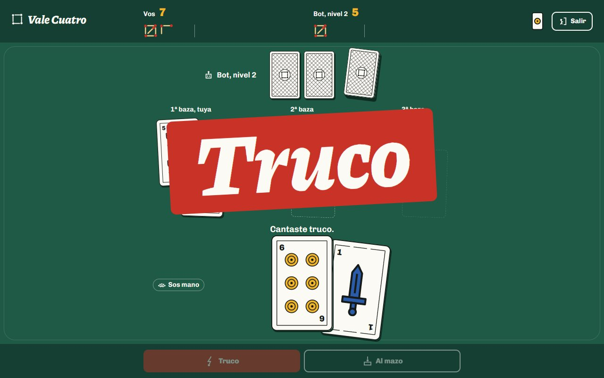

| Portada | Mazo propio |
|---|---|
| 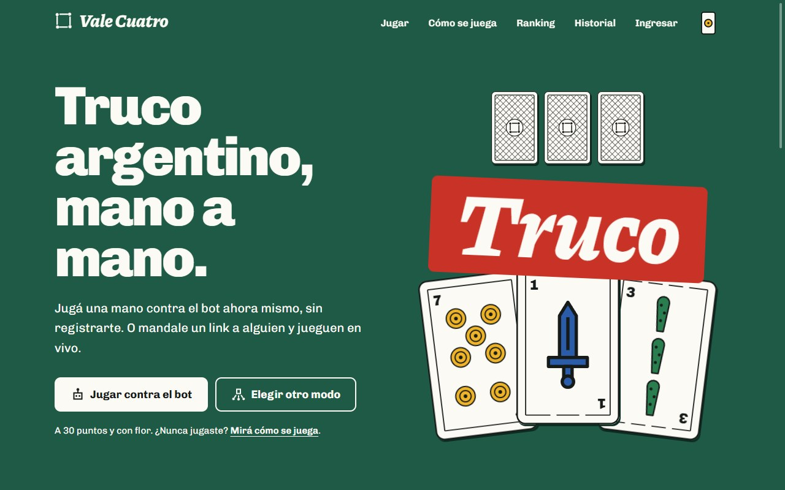 | 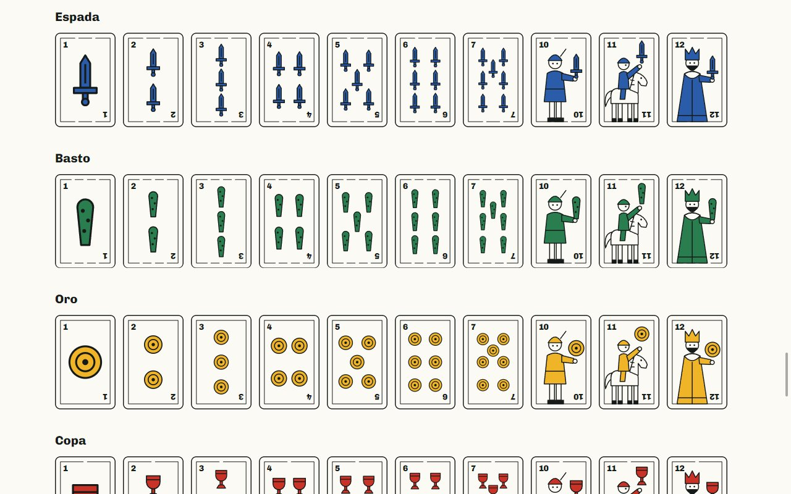 |

| Ranking | Repetición de una partida |
|---|---|
| 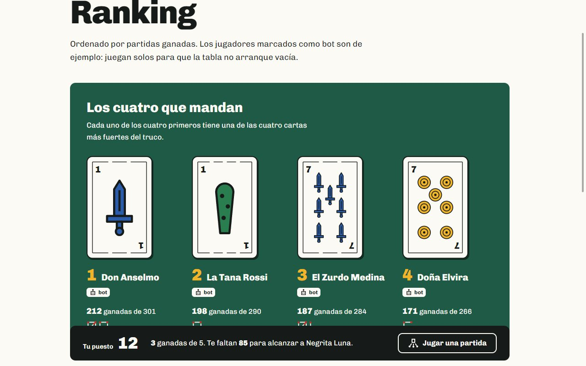 | 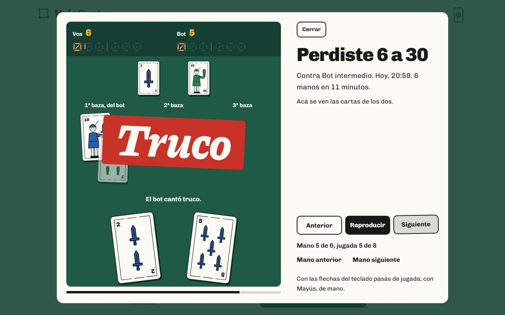 |

| El envido se canta | Cierre de la mano |
|---|---|
| 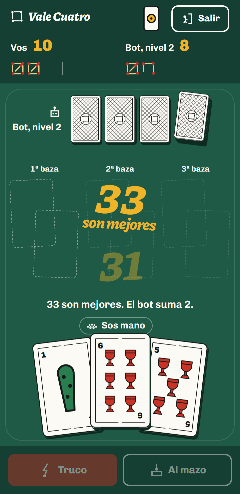 | 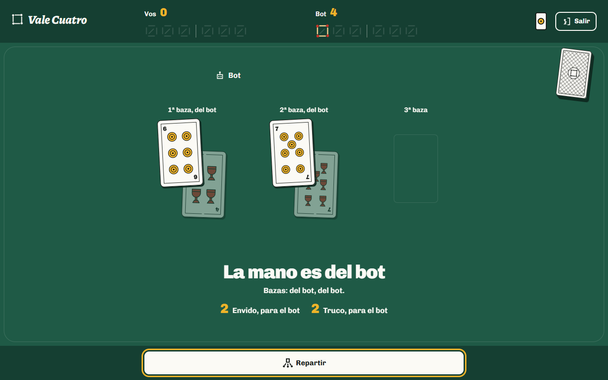 |

| Ingreso | Registro |
|---|---|
| 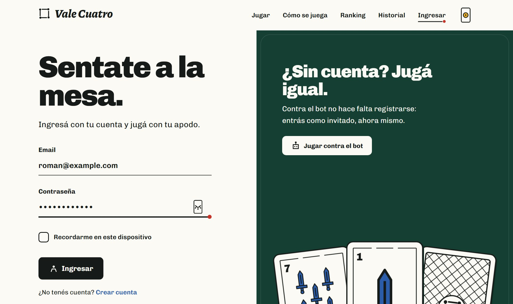 | 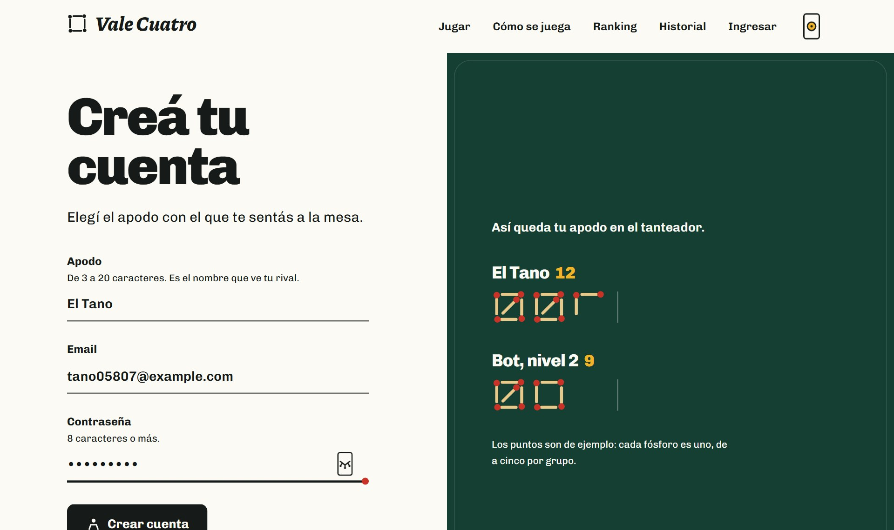 |

| Modos de juego | En el celular |
|---|---|
| 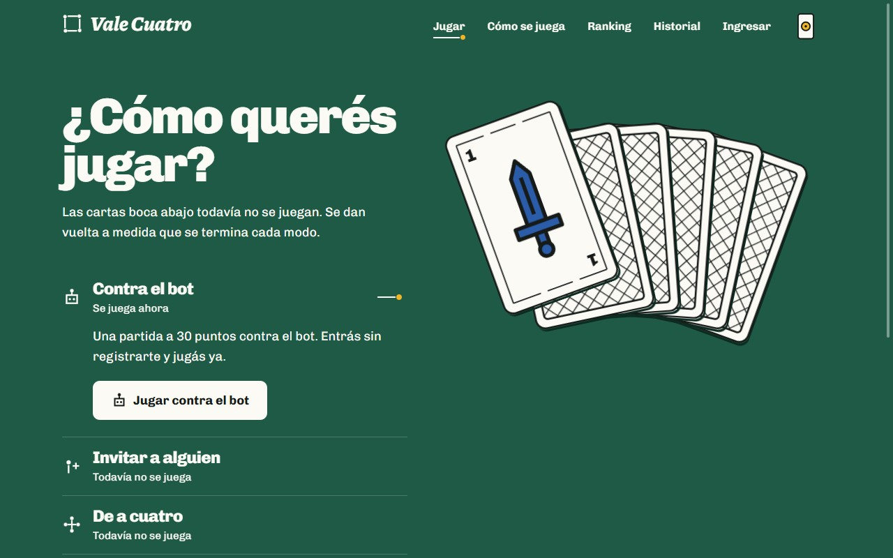 | 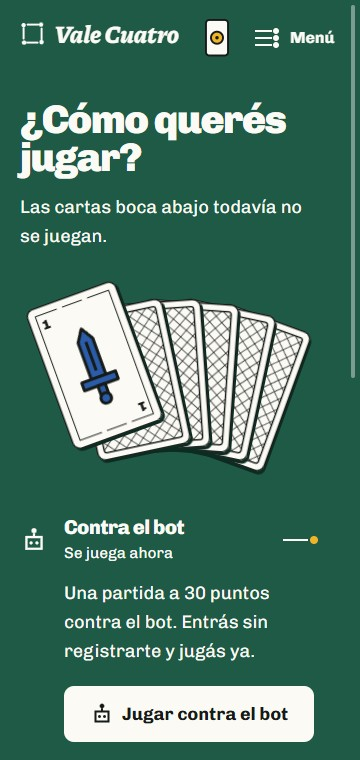 |

## Qué es real y qué es simulado

- **Simulado, y dicho abiertamente en el sitio:** los rivales bot y los jugadores de ejemplo del ranking, que aparecen marcados como bots.
- **Real:** el motor de reglas, el tiempo real por WebSockets, las colas, la API, el historial de partidas y los tests.

## Estado

El proyecto se construye por módulos. Hoy están terminados los dos primeros y hay un adelanto del sexto.

**El juego mano a mano**

| Módulo | Qué es | Estado |
|---|---|---|
| M0 | Identidad visual y maqueta de las pantallas | Listo |
| M1 | Cuentas y modo invitado | Listo |
| M2 | Motor de reglas en PHP puro, pensado por asientos y equipos | Listo |
| M3 | Mesa contra el bot, con la partida guardada como eventos | Pendiente |
| M4 | Bot con tres niveles | Pendiente |
| M5 | Dos personas en tiempo real | Pendiente |
| M6 | Tanteador, cantos y movimiento | En curso: el envido se canta y la mano tiene su cierre |
| M7 | Historial y repetición | Pendiente |
| M8 | Ranking y estadísticas | Pendiente |
| M9 | API pública | Pendiente |
| M10 | Cómo se juega | Pendiente |
| M11 | Calidad y publicación | En curso desde el primer commit |

**Lo que se suma después**

| Módulo | Qué es | Estado |
|---|---|---|
| M12 | Revancha y series al mejor de tres | Pendiente |
| M13 | Torneo relámpago de cuatro u ocho, con llaves en vivo | Pendiente |
| M14 | Sonido de cartas, fósforos y cantos | Pendiente |
| M15 | Instalable en el celular, con aviso de "te toca" | Pendiente |
| M16 | Panel de administración | Pendiente |
| M17 | Modos de juego, desafíos y una escalera de niveles | Adelantada la pantalla para elegir modo; el resto, pendiente |
| M18 | Perfil con categorías ganadas jugando | Pendiente |
| M19 | Truco de a cuatro con señas | Pendiente |
| M20 | Mazos y mesas para elegir | Pendiente |

Las pantallas ya son las definitivas. Las cuentas son reales: se puede registrarse, ingresar, cambiar el apodo o entrar a la mesa como invitado con un solo botón, sin llenar nada.
El motor de reglas ya está escrito y testeado, pero la mesa todavía no lo usa: la mesa, el ranking y el historial siguen mostrando datos de ejemplo fijos hasta que llegue M3.

## Lo que viene

El plan no es solo terminar el mano a mano: el proyecto crece en cuatro direcciones, y el motor se escribe desde el principio para aguantarlas.

- **Más formas de jugar.** Revancha y series al mejor de tres, torneos relámpago por link, desafíos (manos armadas con un objetivo, como "hacé que el bot no quiera"), una escalera de niveles para ir pasando y, al final, truco de a cuatro con señas entre compañeros por un canal privado.
- **Un motor preparado para eso.** Piensa en asientos y equipos, así el mano a mano y el dos contra dos usan las mismas reglas. Reparte con una semilla, para que un desafío o una repetición den siempre las mismas cartas. Puede arrancar desde una situación armada. Y dice qué puede ver cada asiento: de ahí salen el test de que las cartas ajenas nunca llegan al navegador, el bot que no hace trampa y los espectadores del torneo.
- **Jugar mucho se nota.** Categorías ganadas jugando, calculadas desde las partidas igual que el ranking. Destraban cosas solo estéticas: la carta de tu perfil, dorsos (que es lo que ve tu rival), otros mazos y mesas de otro color. Nada da ventaja en el juego, y la identidad se respeta: tintas planas y contraste medido, sin brillos ni degradados.
- **Calidad y publicación.** Pruebas automáticas en un navegador real dentro de la integración continua (jugar una mano, registrarse, entrar como invitado), manejo completo de la cuenta (cambiar la contraseña, recuperarla y borrarla), sonido opcional, instalación en el celular con aviso de turno y un panel de administración.

La publicación está pensada para un plan gratuito: todo el sitio en un solo contenedor (la web, el tiempo real, las colas y las tareas programadas) y la base MySQL en un servicio aparte. Las razones están en [docs/decisiones.md](docs/decisiones.md).

## Cuentas e invitados

- **Un solo botón para jugar.** "Jugar contra el bot" crea un jugador invitado en el momento ("Invitado 48213") y lleva a la mesa.
- **El invitado es un jugador de verdad.** Vive en la misma tabla que las cuentas, y si se registra conserva su fila y lo que jugó. Los invitados que no vuelven en 30 días se borran solos con una tarea programada.
- **Ingreso escrito a mano,** sin kits: contraseña cifrada, sesión renovada al entrar, límite de intentos y el mismo error para un email desconocido que para una contraseña errada.
- **Formularios con las piezas del sitio.** Los campos se subrayan con un fósforo, la contraseña se muestra con una carta que se da vuelta y la mano de cartas se va dando vuelta a medida que se completa el ingreso.

## Identidad

Todo sale del mundo del truco: la baraja española en tintas planas, el paño de la mesa del club y el tanteo con fósforos.

- **Mazo propio:** las 40 cartas están dibujadas en SVG para este proyecto. No hay 40 archivos: un componente arma cada carta con el símbolo de su palo.
- **Tanteador de fósforos:** los puntos se anotan en grupos de cinco, separando malas y buenas.
- **Cantos tipográficos:** cuando alguien canta, la palabra aparece enorme sobre la mesa.
- **Íconos propios:** dibujados con el mismo trazo que los fósforos. No se usa ninguna librería de íconos.
- **Modo claro y oscuro:** el club de día y de noche. Se cambia con una carta que se da vuelta, y las cartas no cambian nunca.

La página `/identidad` muestra logo, colores con su contraste medido, tipografías, mazo e íconos en uso.

## Stack

- Laravel 13, PHP 8.3 y MySQL
- Blade, Tailwind CSS 4 y Alpine.js
- Animaciones con CSS y la Web Animations API, sin librerías
- PHPUnit y Laravel Pint, corridos por GitHub Actions en cada subida
- Tipografías Chivo y Piazzolla, alojadas en el proyecto

Más adelante se suman Laravel Reverb y Echo para el tiempo real, colas, Sanctum con OpenAPI para la API, Laravel Dusk para las pruebas de navegador y Web Push para los avisos.

## Cómo correrlo

Hace falta PHP 8.3 o superior, Composer, Node 22 y MySQL (o MariaDB) con una base vacía llamada `vale_cuatro`.

```bash
composer install
npm install
cp .env.example .env
php artisan key:generate
php artisan migrate
```

El `.env.example` trae los datos de un MySQL local sin contraseña; si el tuyo es distinto, cambiá las líneas `DB_` del `.env` antes de migrar.

Después, en dos terminales:

```bash
php artisan serve
npm run dev
```

El sitio queda en `http://127.0.0.1:8000`.

Para entrar sin registrarse cada vez, `php artisan db:seed` crea tres cuentas de prueba (por ejemplo `roman@valecuatro.test`, contraseña `valecuatro`). Solo existen fuera de producción.

## Tests y estilo

```bash
php artisan test
vendor/bin/pint --test
```

Los tests corren en SQLite en memoria: no necesitan MySQL prendido.

Los del motor de reglas son una suite aparte, que no arranca Laravel:

```bash
vendor/bin/phpunit --testsuite Motor
```

Tienen un test por cada fila de las tablas de pardas y de envido, y partidas enteras jugadas al azar con semilla.

## Decisiones

Las decisiones técnicas importantes están anotadas en [docs/decisiones.md](docs/decisiones.md): qué problema había, qué se eligió y qué se descartó.
